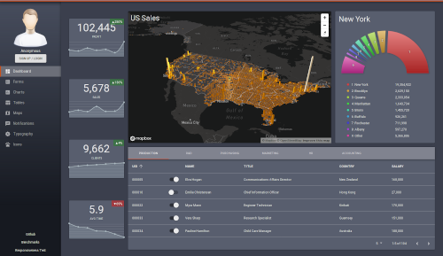
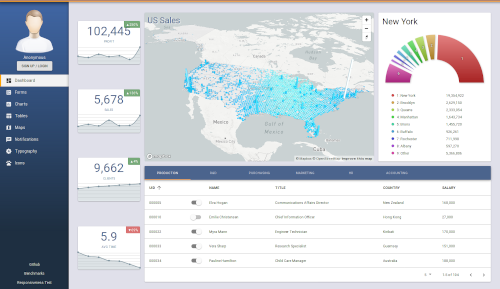

# Next™ React™ Dashboard

A complete React/Redux/Relay/Next.js dashboard template with perfect benchmarks using Material UI and friends.





## Highlights

- React/Redux with Immutable, Thunk, Reselect, etc.

- GraphQL with subscriptions using React Relay Modern

- Next.js with Webpack and Babel doing cached Server Side Rendering (SSR) on an Express.js backend with MongoDB via Mongoose

- Material UI with custom dark and light themes

- Redux Form, Victory Chart, React Intl, etc.

- Email/password or Twitter/Google/Facebook using Passport.js

- Modular "ducks" project structure with Dependency Injection Container

## Installation

NOTE: This project makes use of yarn's "resolutions" feature, so using npm instead of yarn might not be possible

### Sources

```
git clone https://github.com/basarevych/next-dashboard
cp .env.example .env
```

Edit **.env** file and set your options

### Production

```
yarn install --prod
yarn start
```

### Development

```
yarn install
yarn schema
yarn relay
yarn build
```

### Export static files to a CDN

Optionally you can serve the static files from a CDN instead of the backend server which will only be used
for scripts. In order to do so add to your **.env** file on the backend:

```
APP_STATIC=https://example.cdn.com
```

Build the CDN bundle:

```
env APP_STATIC=https://example.cdn.com yarn export
```

This will produce out/ directory which you should publish to the CDN server.
